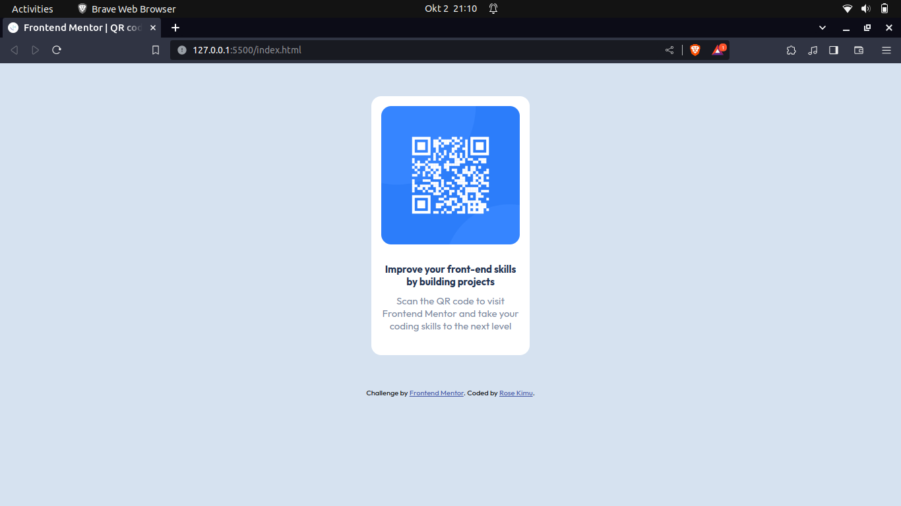

# Frontend Mentor - QR code component solution

This is a solution to the [QR code component challenge on Frontend Mentor](https://www.frontendmentor.io/challenges/qr-code-component-iux_sIO_H). Frontend Mentor challenges help you improve your coding skills by building realistic projects. 

## Table of contents

- [Overview](#overview)
  - [Screenshot](#screenshot)
  - [Links](#links)
- [My process](#my-process)
  - [Built with](#built-with)
  - [What I learned](#what-i-learned)
  - [Continued development](#continued-development)
  - [Useful resources](#useful-resources)
- [Author](#author)

## Overview

### Screenshot

### Links

- Solution URL: [Add solution URL here](https://your-solution-url.com)
- Live Site URL: [Add live site URL here](https://your-live-site-url.com)

## My process

### Built with

- HTML5 markup
- CSS custom properties
- Flexbox

**Note: These are just examples. Delete this note and replace the list above with your own choices**

### What I learned
I learnt how to use flexbox for positioning elements.
I also learn how to bring together knowledge from different aspects that I have been learning
to build a full project.

### Continued development
I want to focus on responsive web development and mobile first approach especiially in building web applications.
I would also want to perfect my CSS positioning skills.

### Useful resources

- [W3 Schools page](https://www.w3schools.com/css/css_dimension.asp) - This helped me to learn how to position the qr-code image within it's parent container so that it wouldn't overflow. I really liked this style and will use it going forward.

## Author

- Website - [Rose Kimu](https://www.your-site.com)
- Frontend Mentor - [@Rose-Kimu](https://www.frontendmentor.io/profile/Rose-Kimu)

